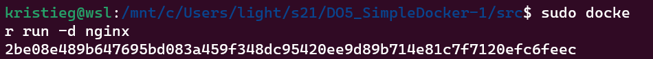
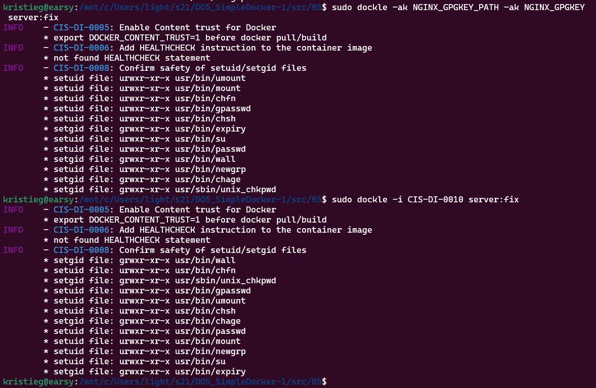

1. [Готовый докер](#part-1-готовый-докер) \
2. [Операции с контейнером](#part-2-операции-с-контейнером) \
3. [Мини веб-сервер](#part-3-мини-веб-сервер) \
4. [Свой докер](#part-4-свой-докер) \
5. [Dockle](#part-5-dockle) \
6. [Базовый Docker Compose](#part-6-базовый-docker-compose)

## Part 1. Готовый докер

**== Выполнение ==**

- Берем официальный образ `nginx` с помощью `docker pull`:

- Проверяем наличие докер образа через `docker images`:

- Запускаем докер образ:

- Проверяем что образ запустился:

- Смотрим информацию о контейнере через `docker inspect nginx`:

  - Размер контейнера:
  
  - Список замапленных портов:
  
  - IP контейнера:
  

- Останавливаем докер образ с помощью `docker stop` и проверяем что он остановился через `docker ps`:

- Запускаем докер с портами `80` и `443` в контейнере nginx, через команду `run`, также проверяем в браузере что по адресу `localhost:80` доступна стартовая страница `nginx`:

- Перезагружаем контейнер с помощью `docker restart` и проверяем перезагрузился ли он с помощью времени работы контейнера в `docker ps`:

## Part 2. Операции с контейнером

**== Выполнение ==**

- Читаем конфигурационный файл с помощью команды `docker exec [container_name] cat /etc/nginx/nginx.conf`

- Создаем файл `nginx.conf` и настраиваем в нем отдачу страницы статуса сервера `nginx`:

- Копируем созданный конфиг внутрьь докер образа через `docker cp` и перезагружаем `nginx` внутри докер образа через команду `docker exec`:

- Проверяем в браузере по адресу `localhost/status` и видим что отдается страница со статусом сервера `nginx`:

- Экспортируем контейнер с помощью `docker export -o`, проверяем экспорт и останавливаем контейнер:

- Удаляем образ `nginx`, затем остановленный контейнер:

- Импортируем образ обратно и запускаем импортированный контейнер. Проверяем в браузере что по адресу `localhost/status` отдается страничка со статусом сервера `nginx`:

## Part 3. Мини веб-сервер

**== Выполнение ==**

- Создаем файл с расширением `.c`, который будет возвращать страничку с надписью `Hello World!`:

- Для запуска данного мини-сервера запускаем контейнер на порту `81`, закидываем в него наш `mini-server.c`, затем запускаем интерактивную сессию `bash` внутри контейнера:

- Внутри контейнера с помощью `apt-get install -y gcc spawn-fcgi libfcgi-dev` устанавливаем подряд все необходимые библиотеки и пакеты для компиляции и запуска сервера. После установки пакетов, компилируем наш сервер(вместе с флагом -lfcgi, т.к. библиотека не стандартная) и запускаем на порту `8080`:

- Пишем свой `nginx.conf` и закидываем через второе окно в наш контейнер в `/etc/nginx/` и перезагружаем `nginx` для работы уже с обновленным конфигом:

- Проверяем в браузере что на `localhost:81` отдается написанная напи страничка:

## Part 4. Свой докер

**== Выполнение ==**

- Создаем `Dockerfile`, который собирает исходники сервера, запускает его, копирует внутрь образ nginx и запускает его, также создаем скрипт `run.sh` который выполняет действия при запуска самого контейнера(entrypoint):

- Собираем докер образ и даем ему название `server` и тег `latest`(дается при введении названия без тега) и сразу проверяем корректность сборки с помощью `docker images`:

- Запускаем докер образ с маппингом 81 порта на 80 на локальной машине и маппингом конфига `nginx` внутрь контейнера, затем проверяем запуск контейнера с помощью `docker ps`, и проверяем что по адресу `localhost` доступна страничка нашего мини-сервера:

- Дописываем в `nginx.conf` проксирование странички `/status` как во второй части:

- Перезапускаем докер образ и проверяем что по адресу `localhost/status` отдается страница со статусом `nginx`:

## Part 5. **Dockle**

**== Выполнение ==**

- Устанавливаем `Dockle`, инструкция по установке на официальном сайте `dockle` (https://github.com/goodwithtech/dockle). Проверяем наш `docker` образ на ошибки:

- Исправляем ошибки чтобы в выводе `dockle` не было ошибок:

## Part 6. Базовый **Docker Compose**

**== Выполнение ==**

- Для начала выполнения этой части установим `docker compose` с помощью `sudo curl -L "https://github.com/docker/compose/releases/latest/download/docker-compose-$(uname -s)-$(uname -m)" -o /usr/local/bin/docker-compose`

- Создаем `docker-compose.yml`:

- Билдим и запускаем `docker-compose`:

- Смотрим браузер по адресу `localhost`, убеждаемся что там наша страничка:

